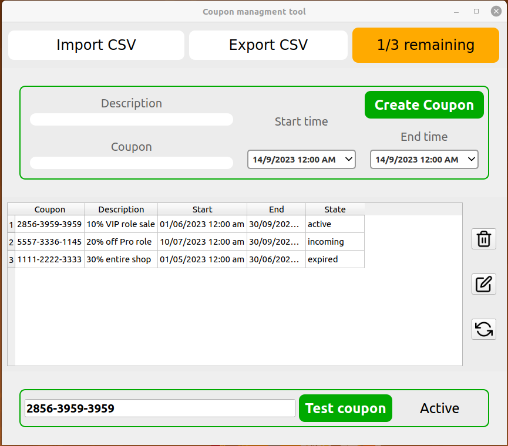

# Coupon Management Tool

A simple and intuitive tool for businesses to create, manage, and track promotional coupons. This tool helps businesses increase engagement, attract new customers, and manage discounts efficiently.

## Features

* **Create Coupons**: Generate unique promotional codes with custom discount values and expiration dates.
* **Manage Coupons**: View, edit, or delete existing coupons easily.
* **Track Sates**: Monitor if coupons have expired.
* **User-Friendly Interface**: Simple, clean interface for easy navigation.

## Preview



[Watch Demo Video](https://youtu.be/dAIs1uwO9Ds)

## Installation

1. Clone the repository:

   ```bash
   git clone https://github.com/kais-grati/Coupon-Managment-Tool
   ```
2. Navigate to the project directory:

   ```bash
   cd coupon-management-tool
   ```
3. Install dependencies (if applicable):

   ```bash
   pip install PyQt5
   ```
4. Start the application:

   ```bash
   python main.py
   ```

## Usage

1. Open the app.
2. Create new coupons with your desired discount and expiration date.
3. Track and manage coupons through the dashboard.
4. Export coupon data if needed for reporting or analytics.

## Contributing

Contributions are welcome! Please fork the repository and create a pull request for any enhancements or bug fixes.

## License

This project is licensed under the MIT License.
